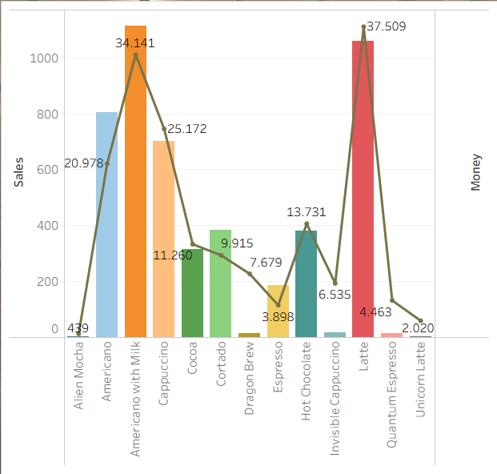
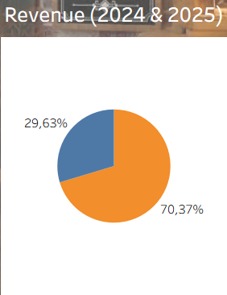
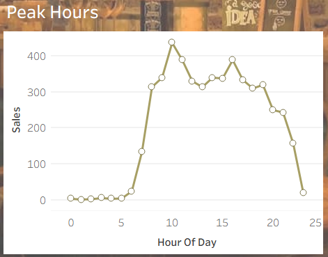

# Dummy Coffee Sales Analysis 

Saya melakukan analisis terhadap data dummy penjualan kopi periode 2024 - 2025 menggunakan Tableau. Berikut hasil yang saya dapatkan:

1. Penjualan tidak selalu berbanding lurus dengan pendapatan.
## Screenshots

Di grafik terlihat bahwa terdapat menu dengan penjualan tinggi namun pendapatan rendah, seperti Americano, Cortado, dan Espresso. DI sisi lain, terdapat juga menu dengan penjualan rendah namun pendapatan tinggi, seperti Dragon Brew, Invisible Cappucino, Quantum Espresso, dan Unicorn Latte.

2. Pendapatan tahun 2025 turun drastis dibandingkan pendapatan tahun 2024. 
## Screenshots

Hal ini bisa terjadi karena banyak faktor, misalnya perubahan tren ngopi anak muda, atau hadirnya kompetitor baru.

3. Coffee shop ini ramai dikunjungi konsumen dari jam 6 pagi sampai jam 11 malam.
## Screenshots

Saran saya:

1. Promosikan dan tingkatkan Harga jual menu andalan seperti Americano with Milk dan Latte, karena mereka sudah memiliki potensi berupa penjualan tinggi.
2. Promosikan menu Dragon Brew, Invisible Cappucino, Quantum Espresso, dan Unicorn Latte, dikarenakan menu tersebut menghasilkan pendapatan tinggi, hanya saja penjualannya masih relatif rendah.
3. Lakukan perubahan pada menu Cortado karena perbandingan penjualan : pendapatan kurang menguntungkan. Produk ini terjual sebanyak 385 kali, namun hanya menghasilkan 9.915.
4. Coffee shop sebaiknya tidak dibuka 24 jam, dikarenakan coffee shop sepi di jam tertentu (11 malam sampai 5 pagi). Maka dari itu, membuka coffee shop 24 jam akan menambah beban pengeluaran.

Tautan grafik: https://public.tableau.com/app/profile/alexandro.galardo/viz/DummyCoffeeSalesAnalysis/Dashboard2?publish=yes